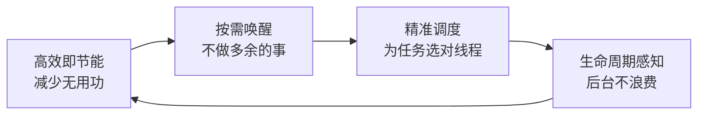

# 功耗与性能平衡优化计划（v3 — Review 修订版）

> 本计划聚焦于 Hanzi Learner 应用的**功耗与性能平衡**——在保持流畅体验的同时，减少不必要的 CPU 唤醒、磁盘 I/O 和后台资源消耗。

## 核心理念



---

## 现状分析

| 维度 | 当前状态 | 功耗影响 |
|------|---------|---------|
| StateFlow 收集 | 全部使用 `collectAsState()`，非生命周期感知 | 🔴 后台仍收集 |
| 备份恢复事务 | `BackupRepository.replaceAll()` **无 `@Transaction`** | 🔴 **数据一致性风险** |
| 协程调度器 | I/O → `Dispatchers.IO`，计算 → `Dispatchers.Default`，基本正确 | 🟡 部分可精细化 |
| 搜索防抖 | [AdminCharacterViewModel](file:///e:/project/hanzi-learner/app/src/main/java/com/hanzi/learner/features/admin/viewmodel/AdminCharacterViewModel.kt#55-291) 已用 `mapLatest`，但无 `debounce` | 🟡 中间计算偏多 |
| `derivedStateOf` | **完全未使用** | 🟡 高频重组未节流 |
| LazyColumn key | ✅ [CharacterManagementTab](file:///e:/project/hanzi-learner/app/src/main/java/com/hanzi/learner/features/admin/ui/tabs/CharacterManagementTab.kt#30-236) / [OverviewTab](file:///e:/project/hanzi-learner/app/src/main/java/com/hanzi/learner/features/admin/ui/tabs/OverviewTab.kt#31-170) 已有 key | 🟢 无需修改 |
| Room WAL | Room 2.x 默认 WAL，但批量写入未用事务 | 🟡 磁盘唤醒偏多 |
| 结构化并发 | Application 级 scope 无生命周期绑定 | 🟡 协程泄漏风险 |

---

## 优化项目清单（7 项）

### PWR-06A 备份恢复事务一致性 ⚡ 

**优先级**: P0 — **数据正确性修复**

> [!CAUTION]
> 这是一个**正确性 bug**，不仅仅是功耗优化。[replaceAll()](file:///e:/project/hanzi-learner/app/src/main/java/com/hanzi/learner/data/repository/BackupRepository.kt#33-39) 先 `deleteAll()` 三张表再 [writeAll()](file:///e:/project/hanzi-learner/app/src/main/java/com/hanzi/learner/data/repository/BackupRepository.kt#44-53)，中途崩溃将导致数据丢失。

**问题**:

[BackupRepository.kt](file:///e:/project/hanzi-learner/app/src/main/java/com/hanzi/learner/data/repository/BackupRepository.kt) 第 33-37 行：
```kotlin
override suspend fun replaceAll(data: BackupData) {
    progressDao.deleteAll()       // ← 如果这里之后崩溃
    phraseOverrideDao.deleteAll() // ← 数据已删除但未写入
    disabledCharDao.deleteAll()
    writeAll(data)                // ← 永远不会执行
}
```

**方案**: 注入 `RoomDatabase` 并使用 `withTransaction`：
```kotlin
class BackupRepository(
    private val database: AppDatabase,  // 新增
    private val progressDao: HanziProgressDao,
    private val phraseOverrideDao: PhraseOverrideDao,
    private val disabledCharDao: DisabledCharDao,
    private val appSettingsDao: AppSettingsDao,
) : BackupRepositoryContract {

    override suspend fun replaceAll(data: BackupData) {
        database.withTransaction {
            progressDao.deleteAll()
            phraseOverrideDao.deleteAll()
            disabledCharDao.deleteAll()
            writeAll(data)
        }
    }

    override suspend fun mergeAll(data: BackupData) {
        database.withTransaction {
            writeAll(data)
        }
    }
}
```

同时 [writeAll](file:///e:/project/hanzi-learner/app/src/main/java/com/hanzi/learner/data/repository/BackupRepository.kt#44-53) 中的逐条 `upsert` 循环也应改为批量插入以减少锁开销。

**影响文件**:
- [BackupRepository.kt](file:///e:/project/hanzi-learner/app/src/main/java/com/hanzi/learner/data/repository/BackupRepository.kt)
- [AppModules.kt](file:///e:/project/hanzi-learner/app/src/main/java/com/hanzi/learner/app/AppModules.kt)（构造参数注入 [AppDatabase](file:///e:/project/hanzi-learner/app/src/main/java/com/hanzi/learner/data/local/AppDatabase.kt#20-91)）

**验收**: 
- 单元测试模拟 [writeAll](file:///e:/project/hanzi-learner/app/src/main/java/com/hanzi/learner/data/repository/BackupRepository.kt#44-53) 中途异常，断言数据未被删除（回滚）
- 备份恢复功能回归通过

---

### PWR-01 `collectAsState()` → `collectAsStateWithLifecycle()`

**优先级**: P0 — 功耗收益最高、改动最简单

**问题**: 16 处 `collectAsState()` 调用点在 Activity 后台时仍持续收集，触发无意义 CPU 唤醒。

> [!NOTE]
> `lifecycle-runtime-compose:2.6.1` 已在 [build.gradle.kts](file:///e:/project/hanzi-learner/app/build.gradle.kts) 第 84 行声明，无需添加依赖。

**方案** — 替换 16 处调用点 + 对应 import：
```diff
-import androidx.compose.runtime.collectAsState
+import androidx.lifecycle.compose.collectAsStateWithLifecycle

-val uiState by viewModel.uiState.collectAsState()
+val uiState by viewModel.uiState.collectAsStateWithLifecycle()
```

**影响文件**:
- [PracticeScreen.kt](file:///e:/project/hanzi-learner/app/src/main/java/com/hanzi/learner/features/practice/ui/PracticeScreen.kt)（2 处调用）
- [HomeScreen.kt](file:///e:/project/hanzi-learner/app/src/main/java/com/hanzi/learner/features/home/ui/HomeScreen.kt)（1 处调用）
- [AdminTabRoutes.kt](file:///e:/project/hanzi-learner/app/src/main/java/com/hanzi/learner/features/admin/ui/AdminTabRoutes.kt)（12 处调用）
- [AdminScreen.kt](file:///e:/project/hanzi-learner/app/src/main/java/com/hanzi/learner/features/admin/ui/AdminScreen.kt)（1 处调用）

**验收**: App 进入后台 60s 后，Profiler CPU 活跃时间 < 1s（对比优化前）。

---

### PWR-02 协程调度器精细化（按代码段）

**优先级**: P1

> [!IMPORTANT]
> 不做模板化 `launch(Default)` + `withContext(Main)` 包裹——大多数 suspend 函数内部已正确使用 `withContext(IO)`，额外包裹只增加上下文切换开销。

**仅针对以下具体代码段**:

**a)** [AdminCharacterViewModel](file:///e:/project/hanzi-learner/app/src/main/java/com/hanzi/learner/features/admin/viewmodel/AdminCharacterViewModel.kt#55-291) — 批量操作引入 `limitedParallelism(1)` 防止并发冲突：
```kotlin
// 用 IO 而非 Default，因为批量操作最终是 DAO I/O，避免 Default->IO 无谓跳转
private val singleOp = Dispatchers.IO.limitedParallelism(1)

fun bulkDisable(chars: List<String>) {
    viewModelScope.launch(singleOp) {
        disabledCharRepository.disableAll(chars)
        refresh() // 已有的刷新机制，ViewModel 不依赖 notifier
    }
}
```

> [!NOTE]
> [AdminCharacterViewModel](file:///e:/project/hanzi-learner/app/src/main/java/com/hanzi/learner/features/admin/viewmodel/AdminCharacterViewModel.kt#55-291) 不持有 [AdminDataChangedNotifier](file:///e:/project/hanzi-learner/app/src/main/java/com/hanzi/learner/features/admin/ui/AdminDataChangedNotifier.kt#8-16)（后者 API 是 [notifyDataChanged()](file:///e:/project/hanzi-learner/app/src/main/java/com/hanzi/learner/features/admin/ui/AdminDataChangedNotifier.kt#12-15)，且仅在 UI 层使用）。ViewModel 内部通过 [refresh()](file:///e:/project/hanzi-learner/app/src/main/java/com/hanzi/learner/features/admin/viewmodel/AdminCharacterViewModel.kt#119-145) 刷新数据。

**b)** `HomeViewModel` — 已正确使用 `launch(dispatcher)` 且 dispatcher 可注入测试，无需改动。✅

**c)** 其他 ViewModel 中的 `viewModelScope.launch { ... }` — 内部 suspend 函数已自带 `withContext(IO)` → **不改动**。

**影响文件**: 仅 [AdminCharacterViewModel.kt](file:///e:/project/hanzi-learner/app/src/main/java/com/hanzi/learner/features/admin/viewmodel/AdminCharacterViewModel.kt)

**验收**: 快速连点"全部禁用"→"全部启用"→"全部禁用"，无并发异常或数据不一致。

---

### PWR-03 搜索输入 `debounce` 节流

**优先级**: P1

> [!WARNING]
> `debounce` 必须只对 `_searchText` 做，不能放在 `combine(...)` 输出上。否则 `_displayCount`（加载更多）和 `_uiState`（刷新）的变化也会被 150ms 延迟，导致 UI 响应迟钟。

**方案**: 先对 `_searchText` 单独 debounce，再参与 combine：
```kotlin
private val debouncedSearchText = _searchText.debounce(150)

val filteredResult: StateFlow<FilteredCharacterResult> = combine(
    debouncedSearchText, _filterMode, _displayCount, _uiState
) { search, filter, count, state ->
    FilterParams(search, filter, count, state)
}.mapLatest { params ->
    withContext(Dispatchers.Default) { /* 过滤逻辑 */ }
}.stateIn(viewModelScope, SharingStarted.WhileSubscribed(5000), FilteredCharacterResult())
```

这样搜索输入有 150ms 防抖，但“加载更多”和“刷新”操作仍然即时响应。

**影响文件**: [AdminCharacterViewModel.kt](file:///e:/project/hanzi-learner/app/src/main/java/com/hanzi/learner/features/admin/viewmodel/AdminCharacterViewModel.kt)

**验收**: 快速连续输入 10 个字符，过滤执行次数 ≤ 3；点击“加载更多”后列表即时更新（无可感知延迟）。

---

### PWR-04 `derivedStateOf` 减少高频重组

**优先级**: P3（降级）

> [!NOTE]
> 当前 `showHintStroke` 只是 `PracticeScreen.kt:349` 的一个内联布尔表达式，而 [PracticeContent](file:///e:/project/hanzi-learner/app/src/main/java/com/hanzi/learner/features/practice/ui/PracticeScreen.kt#135-250) 整体依赖 `uiState`。单独加 `derivedStateOf` 不会减少 [PracticeContent](file:///e:/project/hanzi-learner/app/src/main/java/com/hanzi/learner/features/practice/ui/PracticeScreen.kt#135-250) 本身的重组，只能避免 `HanziTraceOverlay` 的 `showHintStroke` 参数无谓变化。收益有限，作为低优先级待实测确认。

**场景**: 将内联表达式提取为 `derivedStateOf`：
```kotlin
val showHint by remember {
    derivedStateOf {
        uiState.mistakesOnStroke >= uiState.hintAfterMisses
    }
}
```

**影响文件**: [PracticeScreen.kt](file:///e:/project/hanzi-learner/app/src/main/java/com/hanzi/learner/features/practice/ui/PracticeScreen.kt)

**验收**: Layout Inspector 确认是否有可观测的重组次数减少；如无显著改善可回滚。

---

### PWR-06B 批量写入优化

**优先级**: P2

**方案**:

a) **WAL 保持 AUTOMATIC**：当前 Room builder 未显式设置 `JournalMode`，默认为 `AUTOMATIC`，会根据设备条件自动选择 WAL 或 TRUNCATE。在低端/低内存机型上强制 WAL 可能适得其反。**不改动**，保持 Room 默认行为。

b) `BackupRepository.writeAll()` 中的逐条 upsert 改为批量：
```diff
-for (p in data.progress) progressDao.upsert(p)
+progressDao.upsertAll(data.progress)
```
（需在 DAO 中新增 `@Upsert suspend fun upsertAll(entities: List<...>)` 方法）

**影响文件**: 相关 DAO 文件、[BackupRepository.kt](file:///e:/project/hanzi-learner/app/src/main/java/com/hanzi/learner/data/repository/BackupRepository.kt)

**验收**: 全量备份恢复（3000+ 条记录）耗时 ≤ 2s。

---

### PWR-07 结构化并发：Application / TTS 协程生命周期

**优先级**: P3

**a)** `HanziLearnerApplication` — 为无绑定 scope 命名并提供取消入口：
```kotlin
private val appJob = SupervisorJob()
val appScope = CoroutineScope(Dispatchers.IO + appJob)
val containerDeferred: Deferred<AppContainer> by lazy {
    appScope.async { AppContainer(applicationContext) }
}
```

**b)** `SystemTtsSpeaker.shutdown()` — 确保取消 scope：
```diff
 override fun shutdown() {
+    scope.cancel()
     tts?.shutdown()
 }
```

**影响文件**:
- [HanziLearnerApplication.kt](file:///e:/project/hanzi-learner/app/src/main/java/com/hanzi/learner/HanziLearnerApplication.kt)
- [SystemTtsSpeaker.kt](file:///e:/project/hanzi-learner/app/src/main/java/com/hanzi/learner/speech/internal/SystemTtsSpeaker.kt)

**验收**: TtsSpeaker shut down 后 `scope.isActive == false`。

---

### PWR-08 Debug StrictMode 主线程 I/O 检测

**优先级**: P3

**方案**: 在 `HanziLearnerApplication.onCreate()` 中添加：
```kotlin
if (BuildConfig.DEBUG) {
    StrictMode.setThreadPolicy(
        StrictMode.ThreadPolicy.Builder()
            .detectDiskReads().detectDiskWrites()
            .penaltyLog().build()
    )
    StrictMode.setVmPolicy(
        StrictMode.VmPolicy.Builder()
            .detectLeakedClosableObjects()
            .detectLeakedSqlLiteObjects()
            .penaltyLog().build()
    )
}
```

**影响文件**: [HanziLearnerApplication.kt](file:///e:/project/hanzi-learner/app/src/main/java/com/hanzi/learner/HanziLearnerApplication.kt)

**验收**: Debug 构建启动后 60s 内 `StrictMode` tag 的 Logcat 违规条目为 0。

---


## 实施路线

```mermaid
gantt
    title 功耗优化实施路线
    dateFormat  X
    axisFormat %s天

    section 第一批（P0 正确性+高收益）
    PWR-06A 备份事务一致性     :a0, 0, 1
    PWR-01 collectAsStateWithLifecycle  :a1, 0, 1

    section 第二批（P1 精细调优）
    PWR-02 limitedParallelism          :b1, 1, 2
    PWR-03 搜索 debounce               :b2, 1, 2
    PWR-04 derivedStateOf              :b3, 1, 2

    section 第三批（P2-P3 稳健改进）
    PWR-06B WAL+批量写入                :c1, 2, 3
    PWR-07 结构化并发                   :c2, 2, 3
    PWR-08 StrictMode                  :c3, 2, 3
```



**预计总工作量**: 2-3 天

---

## Verification Plan

### Automated Tests

```bash
./gradlew app:testDebugUnitTest
./gradlew app:testDebugUnitTest --tests "*ArchitectureGuardrailsTest*"
./gradlew app:lint
```

### Quantitative Criteria

| 指标 | 测量方式 | 阈值 |
|------|---------|------|
| 后台 CPU 活跃时间 | Profiler → CPU timeline，后台 60s | < 1s |
| 搜索 P95 延迟 | 自定义计时或 Profiler trace | ≤ 300ms |
| 备份恢复耗时 | 日志埋点，3000+ 条全量恢复 | ≤ 2s |
| 批量禁用/启用耗时 | 日志埋点，3000+ 条 | ≤ 1s |
| StrictMode 违规 | Logcat `StrictMode` tag | 0 条 |

---

## Open Questions 决策记录

### Q1: [replaceAll](file:///e:/project/hanzi-learner/app/src/main/java/com/hanzi/learner/data/repository/BackupRepository.kt#33-39) 是否应清空 settings？

**决策**: **不清空** — 保持当前行为。

- `settings` 包含 `useExternalDataset` 字段，控制是否使用外部字库。如果用户只恢复进度数据的备份（`settings = null`），清空 settings 会静默切换回默认内置字库，这是**破坏性且令人困惑**的
- 备份格式已通过 `ExportOptions` 支持选择性导出，"替换"恢复进度数据不应株连无关的配置
- 当备份 **包含** settings 时（`data.settings != null`），[writeAll](file:///e:/project/hanzi-learner/app/src/main/java/com/hanzi/learner/data/repository/BackupRepository.kt#44-53) 已正确写入并覆盖

**无需代码改动**。PWR-06A 的 `withTransaction` 包裹现有逻辑即可。

### Q2: 批量操作是否需要 UI 防重复？

**决策**: **需要** — 在 PWR-02 中一并实现。

`limitedParallelism(1)` 防止并发执行，但操作仍会排队。快速连点 3 次 = 3 次排队执行 + 3 次 [refresh()](file:///e:/project/hanzi-learner/app/src/main/java/com/hanzi/learner/features/admin/viewmodel/AdminCharacterViewModel.kt#119-145)，浪费资源。

**方案**: 在 [AdminCharacterViewModel](file:///e:/project/hanzi-learner/app/src/main/java/com/hanzi/learner/features/admin/viewmodel/AdminCharacterViewModel.kt#55-291) 中添加 `isOperating` 状态：
```kotlin
private val _isOperating = MutableStateFlow(false)
val isOperating: StateFlow<Boolean> = _isOperating.asStateFlow()

fun bulkDisable(chars: List<String>) {
    viewModelScope.launch(singleOp) {
        _isOperating.value = true
        try {
            disabledCharRepository.disableAll(chars)
            refresh()
        } finally {
            _isOperating.value = false
        }
    }
}
```
UI 层根据 `isOperating` 禁用批量操作按钮。改动范围小，在 PWR-02 中一并完成。

---

## Review 修正追溯

| 版本 | 来源 | 修正内容 |
|------|------|---------|
| v1→v2 | Codex GPT-5.3 R1 (6 findings) | PWR-06 拆分为 06A(P0)+06B(P2)；删除 PWR-05；PWR-01 删除冗余依赖步骤；PWR-02 精简为仅 `limitedParallelism`；补充量化验收 |
| v2→v3 | Codex GPT-5.3 R2 (6 findings + 2 questions) | PWR-03 debounce 改为仅对 `_searchText`；PWR-02 修正 API 和 dispatcher；PWR-06B 删除强制 WAL；PWR-04 降级 P3；PWR-01 精确 16 处；解决两个 Open Questions |
```
